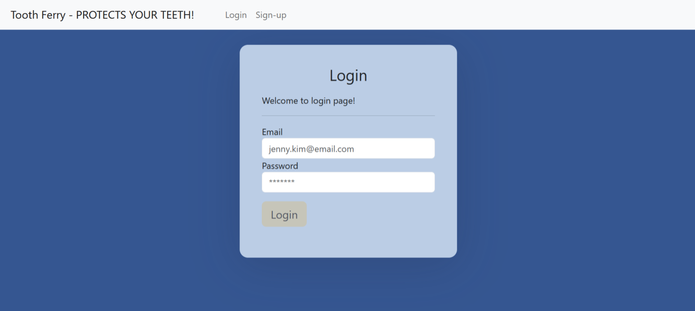
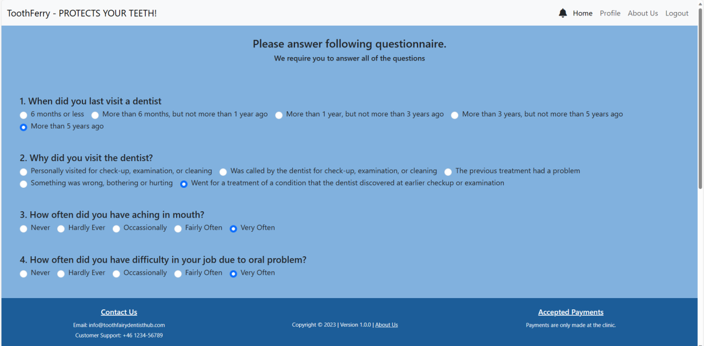
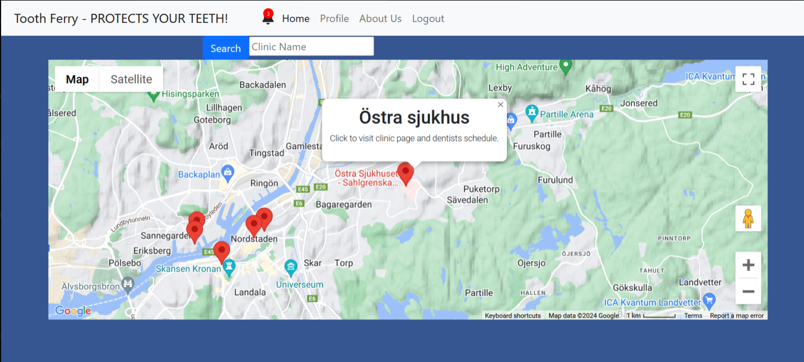
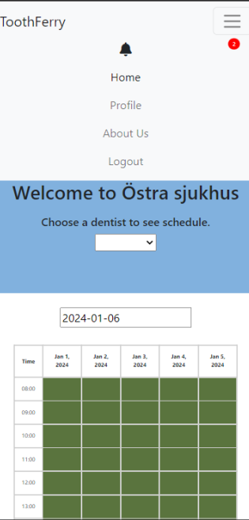

# User-App

## Getting Started

This template should help get you started developing with Vue 3 in Vite.

## Recommended IDE Setup
For an optimal development experience, consider the following IDE setup:

- [VSCode](https://code.visualstudio.com/) 
- [Volar](https://marketplace.visualstudio.com/items?itemName=Vue.volar) (and disable Vetur) 
- [TypeScript Vue Plugin (Volar)](https://marketplace.visualstudio.com/items?itemName=Vue.vscode-typescript-vue-plugin).

## Customize configuration

Refer to [Vite Configuration Reference](https://vitejs.dev/config/) to customize your project configuration.

## Project Setup

```sh
npm install
```

### Compile and Hot-Reload for Development

```sh
npm run dev
```

### Compile and Minify for Production

```sh
npm run build
```

### Lint with [ESLint](https://eslint.org/)

```sh
npm run lint
```
## Features
- Notification System: <br>Receive timely updates on booking status and cancellations.
- Personal Profile Management: <br> Edit, delete, and view personal details conveniently.
- Map Integration:  <br> Locate nearby clinics, view details, and book appointments.
- Appointment Booking:<br>Select dentists, choose time slots, and manage booked appointments.
- Emergency Booking:<br> Swiftly book appointments for urgent dental care needs.
- User-Friendly Interface:<br> Intuitive design with error handling for a smooth user experience.

## Visuals
#### Log in page for the Patients


#### Emergency Booking Form


#### Map with clinics


#### Schedule Page for booking on Mobile



## Usage
#### 1.User Account Management:

- Efficient user login and registration processes.
- Notifications for booking confirmations or cancellations.

#### 2. Personalization and Themes:

- Choose between light and dark themes.
- Personalize language settings for a comfortable experience.

#### 3. Clinic Exploration and Booking:

- Explore clinics on an interactive map with markers.
- Book appointments with preferred clinics and dentists.

#### 4. Appointment Scheduling:

- View available time slots for specific dentists and clinics.
- Book, unbook, and manage appointments seamlessly.


## Support
Please contact our email support123@toothferry.com for any further support.


## Contribution
We welcome further contributions while adhering to our privacy policies.

## Authors and acknowledgement
Show your appreciation to those who have contributed to the User App.

## Project Status
The project has been completed but might require further maintenance and enhancements, such as for scaling further.


